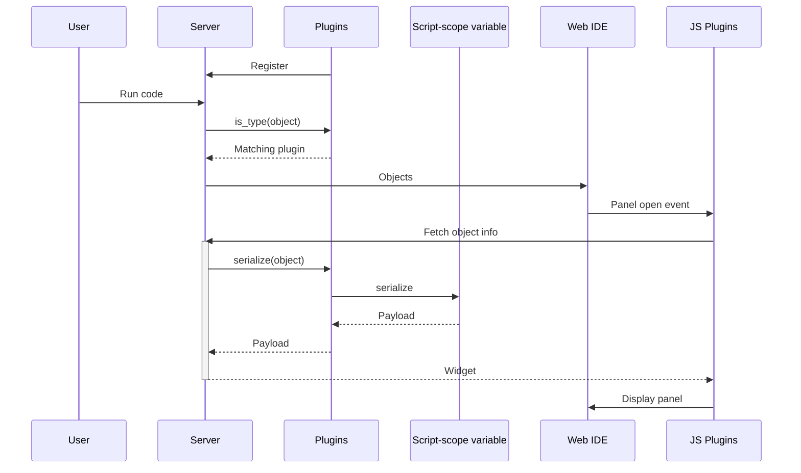
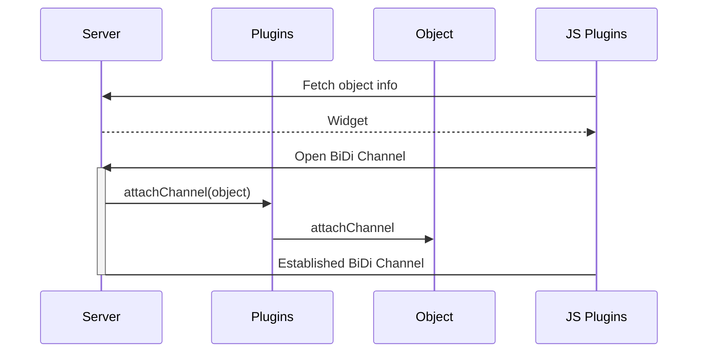
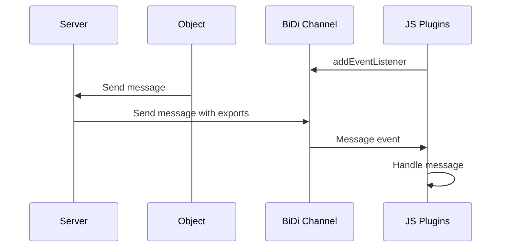
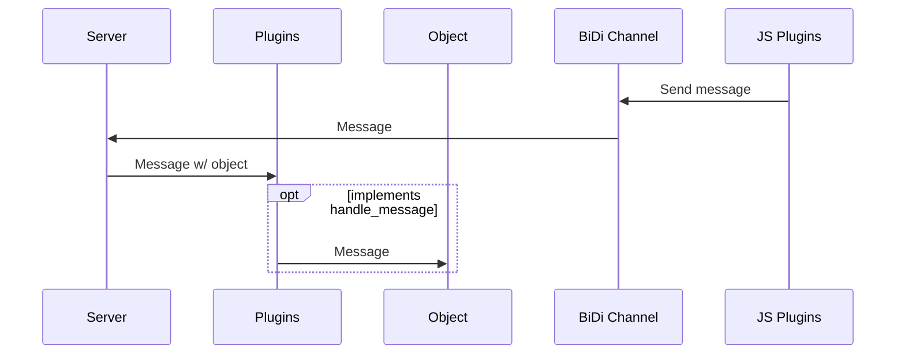

### Overview of Plugins and Widget fetching

```mermaid
sequenceDiagram
  participant U as User
  participant S as Server
  participant P as Plugins
  participant O as Script-scope variable
  participant W as Web IDE
  participant J as JS Plugins
  P ->> S: Register
  U ->> S: Run code
  S ->> P: is_type(object)
  P -->> S: Matching plugin
  S ->> W: Objects
  W ->> J: Panel open event
  J ->> S: Fetch object info
  activate S
  S ->> P: serialize(object)
  P ->> O: serialize
  O -->> P: Payload
  P -->> S: Payload
  S -->> J: Widget
  deactivate S
  J ->> W: Display panel
```

### Establishing BiDi Communication

```mermaid
sequenceDiagram
  participant S as Server
  participant P as Plugins
  participant O as Object
  participant J as JS Plugins
  J ->> S: Fetch object info
  S -->> J: Widget
  J ->> S: Open BiDi Channel
  activate S
  S ->> P: attachChannel(object)
  P ->> O: attachChannel
  S -> J: Established BiDi Channel
  deactivate S
```

### Server message

```mermaid
sequenceDiagram
  participant S as Server
  participant O as Object
  participant B as BiDi Channel
  participant J as JS Plugins
  J ->> B: addEventListener
  O ->> S: Send message
  S ->> B: Send message with exports
  B ->> J: Message event
  J ->> J: Handle message
```

### Client message

```mermaid
sequenceDiagram
  participant S as Server
  participant P as Plugins
  participant O as Object
  participant B as BiDi Channel
  participant J as JS Plugins
  J ->> B: Send message
  B ->> S: Message
  S ->> P: Message w/ object
  opt implements handle_message
    P ->> O: Message
  end
```
